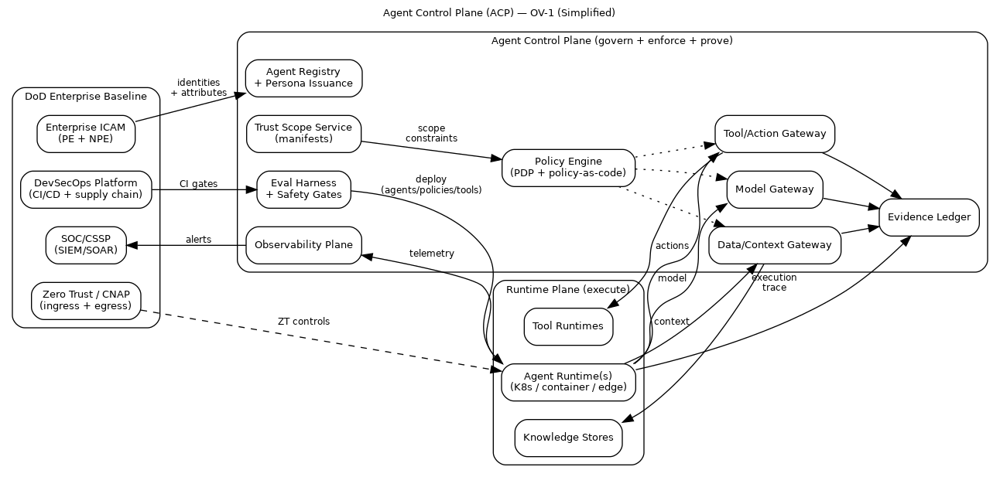
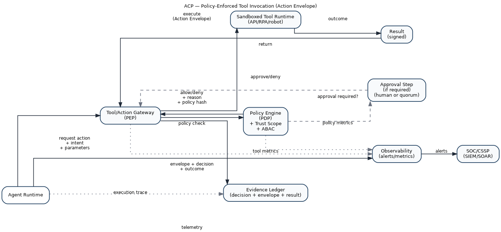
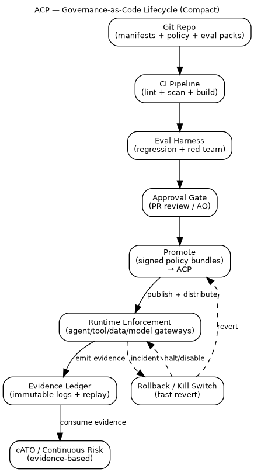

# Agent Control Plane Reference Architecture (ACP‑RA)

(Imported from Telegram draft. This file is the source draft; the LaTeX paper lives in `tex/paper.tex`.)

---
title: "Agent Control Plane Reference Architecture (ACP-RA)"
date: 2026-02-10
description: "A reference architecture for governed, scalable agentic autonomy—single agents and swarms—aligned to DoD CIO patterns (Zero Trust, ICAM, CNAP, DevSecOps, cATO) and designed for contested/degraded operations."
tags:
  - autonomy
  - agents
  - control-plane
  - multi-agent
  - swarm-governance
  - zero-trust
  - icam
  - devsecops
  - cato
  - evidence
  - contested-ops
  - tool-supply-chain
  - a2a
  - mcp
---

# Agent Control Plane Reference Architecture (ACP‑RA)

## Executive summary

Agentic autonomy is shifting the unit of output from *human-hours* to *agent-hours*. That is the transition from “force multiplication” to “force creation”: intent-driven systems executing within delegated authority, scaling through silicon rather than staffing. In practical terms, decision tempo and execution density can exceed human relevance windows—especially in contested environments where connectivity is intermittent and deception is routine.

The Agent Control Plane (ACP) exists to make this transition **fieldable**.

It is the mechanism that lets the Department move faster **without** turning speed into unmanaged risk. It does this by standardizing and enforcing:

- **Identity** for agents as non-person entities (NPEs)
- **Delegated authority** as explicit trust scopes
- **Work units** as the supervised unit of long-running, parallel agent execution
- **Mediated action** through tool and inter-agent gateways
- **Governance as code** with continuous evaluation and promotion gates
- **Evidence and replay** sufficient for continuous authorization and after-action reconstruction
- **Swarm/ensemble governance** so multi-agent coordination remains bounded, attributable, and containable
- **Degraded-mode survivability** so autonomy degrades safely when networks, models, or services are denied

This document is written as a DoD CIO–style reference architecture: strategic purpose, principles, technical positions, patterns, and vocabulary. It is intended to guide and constrain downstream solution architectures rather than prescribe a single implementation.

---

## Scope and non-goals

### In scope
- Enterprise, intelligence, and operational-support agents that plan, coordinate, and invoke tools/actions within bounded authority
- Multi-agent ensembles (swarms) and their coordination, messaging, shared state, budgets, observability, and containment
- Work-unit management for long-running and parallel agent execution (checkpointing, dependencies, cancellation, supervision)
- Policy-as-code, evaluation-as-gate, and evidence generation for continuous authorization
- Cross-enclave federation and cross-domain handoffs (identity, context, and evidence)

### Out of scope
- Tactical employment guidance for autonomous weapons
- Authorization of use-of-force decisions
- Any design that bypasses applicable weapon system autonomy policy (see DoDD 3000.09)

Where agents integrate into systems adjacent to use-of-force or mission-critical safety, additional governance, testing, and policy applies. DoDD 3000.09 remains the governing policy for autonomy in weapon systems.  
(References: DoDD 3000.09; see Appendix “References.”)

---

## Strategic drivers

### A posture of acceleration
Recent Department strategy and senior-leadership messaging emphasize acceleration in AI adoption, experimentation, compute access, and rapid iteration. This architecture treats that posture as a constraint: platforms must support rapid onboarding and change while staying governable and reversible.

### The core problem is shifting from “can agents do X?” to “can people supervise agents at scale?”
Commercial agent systems are converging on a command-center model: many tasks in parallel, long-running execution, and human supervision as a portfolio function rather than a per-action bottleneck. For the Department, this shift is not cosmetic—it drives requirements for work-unit identity, evidence indexing, pause/resume semantics, and escalation controls that remain enforceable at machine tempo.

### Contested and degraded environments are the baseline, not the exception
Agentic systems fail differently than traditional software. They are vulnerable to deception, poisoning, and cascade failures—especially when they coordinate as ensembles. The control plane must survive partial connectivity, intermittent access to centralized services, and adversary attempts to subvert policy and evidence mechanisms themselves.

### Interoperability and federation are unavoidable
DoD reality is federated: Services, agencies, mission partners, and multiple classification enclaves. Interoperability is also plural: agent-to-agent messaging and agent-to-tool/data connectors are both being standardized in industry. The ACP must be **protocol-neutral** while enforcing a consistent policy surface across whichever interop protocols are in use.

---

## Architectural principles

### P1 — Agents are non-person entities (NPEs), not “apps”
Agents must have identity, credentials, lifecycle controls, and attributes consistent with enterprise identity patterns. Treat them as first-class actors with accountability.

### P2 — Centralize policy decisions; distribute enforcement
The ACP uses a policy decision point (PDP) with multiple policy enforcement points (PEPs): at runtime admission, model routing, context retrieval, tool invocation, inter-agent messaging, and work-unit state transitions.

### P3 — Default deny; allow by explicit trust scope
Agents do not gain authority because a prompt implies it. Authority is granted by a signed, versioned trust scope manifest and enforced by gateways.

### P4 — The “doing boundary” is explicit
Tool calls and other side effects are mediated. Every action is a policy event. “It can think” is not the same as “it can do.”

### P5 — Evidence is first-class
Evidence is produced at the same tempo as actions. Continuous authorization and credible after-action review require deterministic, replayable artifacts.

### P6 — Rollback and containment are capabilities
Speed wins only if rollback is instant and scoped. Containment must isolate a single agent without collapsing an ensemble.

### P7 — Context engineering is governed data movement
Context is not a prompt trick; it is a data plane. Provenance, minimization, freshness, and labeling are mandatory.

### P8 — Evals and monitoring are gates
Continuous evaluation, red-teaming, drift detection, and anomaly response are not documentation—they are release and runtime gates.

### P9 — Budgets are policy, not accounting
Compute, bandwidth, tool calls, and power are operational constraints. Autonomy must operate within explicit budgets—especially in contested logistics.

### P10 — Tools/skills are a supply chain
Agent capability expansion via tools, connectors, and “skills” is unavoidable. Tool ecosystems become attack surfaces. Therefore: tools are onboarded, signed, scanned, evaluated, and attested like software packages; execution is sandboxed and governed by trust scope.

---

## Reference architecture structure

DoD CIO reference architectures guide and constrain downstream architectures by providing: **strategic purpose, principles, technical positions, patterns, and vocabulary**. ACP‑RA uses that same structure.

- **Strategic purpose:** why ACP exists
- **Principles:** non-negotiable engineering behavior
- **Technical positions:** required control surfaces and boundary points
- **Patterns:** reusable implementation guidance
- **Vocabulary:** consistent terms that prevent “same word, different meaning” failures

---

## Conceptual view (OV‑1)

<!-- FIGURE: ACP OV-1 (./diagrams/acp_ov1_simplified.png) -->


The conceptual model is a control system with two planes:

- **Runtime plane:** agent runtimes executing plans and invoking tools (K8s, edge nodes, mission systems)
- **Control plane:** identity, trust scopes, work units, policy, gateways, evaluation, evidence, observability, and containment

The ACP does not “run the mission.” It constrains, mediates, and proves mission execution.

---

# Core vocabulary

This section defines primitives that remain stable even as frameworks change.

## Agent
A software actor that can plan, retrieve context, communicate, invoke tools, and execute actions toward a goal within bounded authority.

## Persona
A controlled mission role for an agent (e.g., enterprise drafting, logistics planner, intel triage, policy checker). Persona is an attribute used by policy.

## Trust Scope Manifest (TSM)
A signed, versioned contract defining an agent’s delegated authority and constraints:
- allowed/prohibited actions and tools
- consequence tier
- operating environment (enclave/classification/connectivity)
- uncertainty thresholds and escalation triggers
- budgets (compute/tokens/tool calls/egress/power/time)
- evidence requirements (fields, redactions, retention)
- degraded-mode behaviors and containment semantics

## Work unit
A durable, supervised task thread for long-running and parallel agent execution.

A work unit binds:
- a **scope context** (trust scope hash + policy bundle hash)
- **budgets** (initial allocation + delegated allowances)
- **dependencies** (work-unit DAG and blocking conditions)
- **checkpoint policy** (what is persisted, when, and how to resume)
- **sandbox provenance** (execution environment identifiers / attestations where available)
- **evidence root** (the stable anchor used to query all actions/messages/artifacts for this work unit)

Work units are how the Department supervises autonomy at scale: humans do not “watch every tool call,” they supervise work units, review diffs, and intervene on escalation triggers.

## Policy bundle
A signed, versioned set of policy rules consumed by enforcement points:
- ABAC rules
- escalation rules
- budget policies
- inter-agent messaging policies
- safety interlocks (quarantine/kill/rollback)
- work-unit transition constraints (pause/resume/cancel)

## Context bundle
A replayable artifact representing retrieved/used context:
- source pointers, timestamps, labels/tags
- provenance and integrity metadata
- minimization decisions
- freshness/rot signals
- a stable hash identifier (so later evidence can reference it)

## Action envelope
A signed record of an attempted tool/action:
- work_unit_id
- request intent + parameters
- policy decision + policy hash
- approvals and override records (if any)
- execution environment and attestation identifiers
- outcome metadata
- evidence pointers for replay

## Inter-agent message envelope
A signed record of a message between agents (or ensembles):
- work_unit_id (and optionally ensemble_id)
- sender/receiver identities and personas
- message type (typed schema)
- TTL, rate-limit class, and fan-out metadata
- provenance hashes (policy, tool outputs, referenced context bundles)
- minimal “why” field for auditability

## Ensemble (swarm)
A first-class multi-agent object with explicit governance:
- membership and roles
- coordination pattern and arbitration rules
- shared-state rules and boundaries
- ensemble budgets and allocation policy
- inter-agent communication policy
- containment semantics (isolate member vs freeze ensemble)

---

# Consequence tiers and required controls

Trust scopes and ensembles reference consequence tiers explicitly. Consequence is the most effective way to translate “mission impact” into enforceable controls.

| Tier | Representative activities (non-exhaustive) | Minimum required controls |
|---|---|---|
| **T0 — Low** | drafting, summarization, analysis with read-only context | NPE identity; data/tag controls; basic evidence logging; deny-by-default tool use |
| **T1 — Moderate** | PR creation, ticket automation, config recommendations (no direct apply) | tool mediation; budgets (tokens/tool calls/egress); baseline eval pack; drift monitoring |
| **T2 — High** | executing changes in production, account/permission changes, external comms; GUI-based operations in controlled environments | human-on-the-loop approvals; dual-control for sensitive actions; enhanced evidence; rollback rehearsal |
| **T3 — Life/Safety / Mission-Critical** | actions affecting safety, critical infrastructure, or kinetic-adjacent effects | strict deny-by-default; quorum approvals; constrained degraded modes; full-fidelity evidence on trigger; mandatory after-action review |

**Composition rule:** when scopes combine (agent→agent, agent→ensemble, cross-enclave), authority composes by **intersection**, not union. The effective authority is the overlap of allowed actions, data, and environments—never the sum.

---

# Technical positions (required control surfaces)

ACP‑RA constrains solution architectures through required control surfaces and boundary points.

## TP1 — Agent identity as NPE (ICAM-aligned)
Every agent and tool-runtime has an identity, attributes, and lifecycle controls. Sponsorship and ownership are attributable.

## TP2 — Trust scopes are signed, versioned, and enforceable
Trust scopes are artifacts. Enforcement points validate and cache them. Scope changes require promotion gates.

## TP3 — Work units are first-class governance objects
Every long-running agent effort is a work unit with:
- bounded scope and budgets
- explicit dependencies and cancellation semantics
- checkpoint and resume behavior
- evidence anchoring for replay

## TP4 — Tool/Action Gateway mediates all “doing”
No direct access from model runtime to privileged tools. Tool calls are policy checked, budgeted, sandboxed, and logged.

## TP5 — Tools/skills are onboarded through supply-chain controls
Tools, connectors, and skills are:
- registered
- signed
- scanned (static + dependency + behavior checks)
- evaluated with tool-specific eval packs
- attested at runtime (hashes, signatures, scanner verdicts)

## TP6 — Inter-Agent Gateway governs agent-to-agent communication
Agent-to-agent messaging is authenticated, authorized, schema-validated, rate-limited, and attributable. It has circuit breakers to prevent cascades.

## TP7 — Context/Data Gateway governs context engineering
Context retrieval is policy checked, tag-aware, provenance-preserving, and freshness-aware. Context becomes a replayable bundle.

## TP8 — Model Gateway governs model routing and upgrades
Model usage is controlled by allowlists, routing policies, canary/rollback, and evidence capture. The ACP never assumes a single model or vendor.

## TP9 — Evaluation harness gates promotion; monitoring gates runtime
Evals are blocking checks (functional + policy conformance + adversarial tests). Runtime monitors detect drift and trigger containment.

## TP10 — Evidence ledger is tamper-evident and queryable
Actions, context bundles, policy decisions, approvals, inter-agent envelopes, and containment events generate structured evidence sufficient for replay and continuous authorization.

## TP11 — Degraded-mode behaviors are declared and enforced
When connectivity, model access, or centralized policy is denied, the system transitions to a defined degraded mode with tightened authority.

---

# Architecture components

The ACP is best understood as a set of “bulkheads” and “gates.” Bulkheads contain failures. Gates enforce policy.

## 1) Agent registry and persona issuance
This component issues and manages agent identities and personas:
- NPE identifiers and credentials
- ownership/sponsorship binding
- attribute issuance for ABAC (mission, enclave, tier, approved tools)
- lifecycle: onboarding, rotation, revocation

## 2) Trust scope service
The trust scope service stores and signs manifests, enforces schema, and supports delegation:
- scope templates by tier and mission thread
- scope inheritance and delegation (budgets, tool subsets)
- scope translation and intersection rules for federation

## 3) Work Unit Service (WUS)
This service creates and tracks work units as supervised objects:
- issues work_unit_id and binds it to trust scope + policy bundle hashes
- tracks work-unit state (queued/running/paused/blocked/canceled/completed)
- tracks dependencies (work-unit DAG) and deadlock timeouts
- manages checkpointing and resume policies (including degraded modes)
- allocates and reclaims budgets (and delegated allowances) for sub-agents
- provides a stable evidence anchor for querying actions/messages/artifacts at scale

## 4) Supervision console (Human Direction and Oversight Surface)
This is not “a UI.” It is an operational control surface that enables humans to supervise autonomy at scale without becoming the throughput bottleneck.

Minimum capabilities:
- work-unit dashboard (status, dependencies, budget burn-down, anomaly flags)
- review surfaces for outputs (diff review for code/config; artifact review for plans)
- approval queue (human-on-the-loop and quorum workflows)
- intervention controls (pause/resume/cancel; quarantine/kill; tighten scope)
- evidence drill-down by work_unit_id (macro→meso→micro replay tiers)
- after-action review workflow that generates new eval cases and policy refinements

## 5) Policy engine (PDP) and distributed enforcement (PEPs)
The policy engine evaluates requests using:
- agent identity attributes + persona
- trust scope claims
- work-unit state and constraints
- environment signals (enclave, connectivity mode, posture)
- resource tags (data labels, tool categories)
- current budgets and risk posture

PEPs exist at:
- runtime admission control
- tool/action gateway
- context/data gateway
- inter-agent gateway
- model gateway
- work-unit transitions (pause/resume/cancel)
- CI/CD promotion gates

## 6) Model gateway
The model gateway enforces:
- model allowlists by enclave and trust scope
- routing by consequence tier and degraded mode
- budget limits (tokens/compute/time)
- metadata capture for replay and auditing

The model gateway is also the upgrade discipline:
- shadow → canary → promote → rollback
- policy-hash and eval-pack gating

## 7) Context/Data gateway
This gateway turns “context engineering” into a governed plane:
- tag-aware access controls
- provenance capture (source/time/label/custody pointer)
- minimization and redaction
- freshness SLAs and “context rot” warnings
- production of stable context bundles referenced by action envelopes

## 8) Tool/Action gateway
This is the most important boundary: it mediates side effects.
- allowlists/denylists by scope and tier
- approvals and quorum requirements for high consequence
- secrets brokerage (tools get secrets; models do not)
- sandboxed execution environments
- idempotency keys and retry control to prevent amplification
- action envelopes emitted to evidence ledger
- tool provenance and attestation stamped into every action envelope

### Tool/skill supply chain governance (registry + provenance tiers)
Agent ecosystems expand by attaching tools, connectors, and “skills.” Open marketplaces make that expansion fast—and create a predictable attack surface.

The ACP therefore treats tools and skills as a governed supply chain:

- **Provenance tiers**
  - *Tier A:* first-party tools (Department-owned) with full pipeline attestation
  - *Tier B:* vetted third-party tools (signed + scanned + evaluated + constrained)
  - *Tier C:* untrusted/community tools (denied by default; allowed only in isolated sandboxes and low-tier scopes, if allowed at all)

- **Onboarding pipeline (minimum)**
  - manifest + schema validation
  - dependency analysis + SBOM generation
  - static analysis and policy linting
  - sandbox behavior tests and tool eval packs
  - signing and publishing to a controlled registry
  - runtime attestation (hash/signature match) enforced by the gateway

- **Operational controls**
  - quarantine workflows for tools with anomalous behavior
  - revocation and emergency denylist distribution
  - registry reputation signals (usage history, incident linkage)

The goal is simple: adding tools expands capability **without** expanding unbounded risk.

### Computer-use / GUI actuation tools (OS-level and RPA class)
A special class of tools exists where the “tool” is a computer: mouse/keyboard control, screenshots, UI navigation, and OS-level actions. This class is powerful and fragile, and it is high-risk by default.

Policy requirements for computer-use tools:
- run inside isolated desktop environments (VDI/sandbox) with governed network egress
- restrict accessible applications and UI surfaces by scope
- capture structured evidence: screenshots and/or session capture at policy-defined sampling rates
- enforce per-step budgets (clicks/keystrokes/time) and fan-out limits
- treat this class as **T2 by default** unless explicitly lowered by risk assessment and controls
- require veto windows or approvals for irreversible actions (credential changes, external communications, destructive operations)

These constraints turn “computer use” from a hidden capability into a governed actuation surface.

## 9) Inter-Agent Gateway (IAG)
Multi-agent systems only scale safely if agent-to-agent communication is treated like a governed mesh.

The IAG is intentionally **protocol-neutral**. It can front interoperable protocols such as the Agent2Agent (A2A) protocol or the Model Context Protocol (MCP)—or successor protocols that provide similar semantics. The ACP does not bet on a single wire protocol; it standardizes the policy surface required no matter what carries the message.

**Required policy surface (independent of protocol):**
- mutual authentication of sender/receiver identities and runtime provenance
- authorization of message types and peer relationships by trust scope + persona + environment
- schema validation (typed envelopes; no arbitrary prompt blobs as transport)
- rate limits + TTLs + fan-out caps to prevent cascades
- provenance: message hashes, policy hash, sender/receiver ids
- circuit breakers: cascade detection and automatic throttling/quarantine triggers
- evidence emission: ensemble graph metadata sufficient for replay and triage

### A2A ↔ MCP crosswalk (how both map to ACP boundaries)
A2A and MCP address different interoperability surfaces. The ACP governs both by applying the same policy primitives—identity, trust scope, budgets, and evidence—at the appropriate gateway.

| Interop surface | Typical protocol family | ACP enforcement boundary | Governance focus |
|---|---|---|---|
| Agent ↔ Agent (delegation, coordination, swarm messaging) | A2A or equivalent | Inter-Agent Gateway (IAG) | peer allowlists, message-type schemas, fan-out limits, cascade breakers, message provenance, ensemble graph evidence |
| Agent ↔ Tool/Data connectors (capabilities, resources, data access) | MCP or equivalent | Tool/Action Gateway + Context/Data Gateway | tool allowlists, connector provenance tiers, consent/permissions, sampling controls, connector attestation, context provenance |
| Tool/Connector requests model sampling | MCP sampling flows or equivalents | Model Gateway (with policy hooks) | model selection control, budget enforcement, evidence capture, deny-by-default for server-initiated sampling when prohibited |
| Agent output becomes executable action | N/A | Tool/Action Gateway | approvals/quorums, sandboxing, secrets brokerage, action envelopes, rollback/replay |

The design goal is not to predict which protocol dominates. The goal is to ensure that whichever protocols are used, they terminate at governed boundaries with consistent controls.

## 10) Evaluation harness (functional + adversarial) and tool eval packs
The evaluation harness provides:
- baseline functional tests (“golden tasks”)
- policy conformance tests (permission boundaries, tool misuse attempts)
- adversarial tests (retrieval injection, poisoning simulations, inter-agent influence scenarios)
- regression gates against last-known-good
- rollback/containment rehearsal checks

### Tool contract design (tools as contracts for non-deterministic callers)
Agents call tools differently than deterministic software. Tool APIs must be designed as contracts for a non-deterministic caller:

- typed inputs and outputs (schema-first)
- explicit preconditions and failure modes (deterministic error taxonomy)
- bounded side effects (idempotent operations where possible)
- small, verifiable outputs (avoid mixing commentary with data payloads)
- safe defaults (read-only by default; explicit “apply” actions separated and tiered)
- strict secrets boundaries (no credential material in tool outputs)

### Tool eval packs (gating tool onboarding and tool changes)
New tools and tool changes require tool-specific eval packs, including:
- misuse probes (attempted actions out of scope)
- output-injection probes (tool outputs crafted to steer agents)
- retry amplification tests (error storms and idempotency validation)
- performance/latency tests (avoid tool DoS cascades)
- “computer use” class tests (UI ambiguity, evidence capture, step budgets)

## 11) Evidence ledger and replay service
Evidence is a structured event stream supporting:
- attribution: who/what/under which scope/policy
- replay: reconstructing intent → context → decision → action → outcome
- continuous authorization: evidence inside the system boundary

### Swarm-scale evidence: hierarchical aggregation for practical replay
Swarm replay can be prohibitively expensive if every message and trace is retained at full fidelity. ACP uses hierarchical evidence aggregation:

**Per-agent evidence (always-on):**
- action envelopes
- inter-agent message envelopes (metadata always; payload by tier/trigger)
- context bundle hashes + provenance pointers (payload capture by tier/trigger)
- policy decisions (inputs/outputs + policy hash)
- drift/anomaly signals (summaries)

**Ensemble evidence (always-on, lightweight):**
- coordination graph metadata (A2A edges by type and time)
- arbitration outcomes (conflicts, quorums, deadlocks/timeouts)
- budget burn-down time series (aggregate and per-role)
- work-unit DAG summaries (dependencies, blocks, cancellations)

**Selective enrichment (triggered):**
- full message bodies, full context payloads, and detailed planning traces captured on:
  - anomaly thresholds,
  - high-consequence actions,
  - investigation holds.

This yields three replay tiers:
1) macro replay (graph + budgets + key decisions) for fast SOC/CSSP triage  
2) meso replay (selected agents/intervals) for root-cause on a suspected subgraph  
3) micro replay (full payloads) for high-consequence or legal/incident requirements

## 12) Observability and SOC/CSSP integration
ACP emits telemetry so operations teams can see:
- allow/deny rates by scope/tool/data tag
- tool-call distributions and anomaly signals
- model routing changes and regression alerts
- work-unit status and stall signals (blocked, deadlocked, retry storms)
- containment events (quarantine/kill/rollback) with evidence pointers

### Swarm observability: SOC/CSSP views
For ensembles, the primary failure mode is a coordination cascade. ACP provides swarm-specific views:

**Dashboards**
- coordination graph (A2A edges by type over time; fan-out heatmap)
- arbitration events (conflicts, quorums, leader changes, deadlocks/timeouts)
- budget burn-down (aggregate + per-role + anomaly overlays)
- ensemble drift (distribution shifts across actions/plans)
- work-unit DAG health (dependency blocks, repeated stalls)
- containment posture (quarantined members, degraded mode active, policy lockdown status)

**Alertable signals**
- fan-out spikes and retry storms
- message-type violations (out-of-scope coordination attempts)
- budget exhaustion anomalies (loops, adversarial stimulus)
- tool-call distribution shifts at ensemble level
- quarantine and kill-switch activations with evidence references

## 13) Containment and revocation
Containment operates at multiple levels:
- **agent kill:** stop runtime, revoke credentials, invalidate scopes
- **agent quarantine:** keep runtime alive but tool-isolated for triage
- **ensemble freeze:** pause coordination, preserve state for replay
- **ensemble degrade:** force safe mode (local models only; read-only tools)
- **policy lockdown:** tighten scopes rapidly across the ensemble
- **work-unit freeze:** pause one work unit while allowing others to continue

Containment must be fast (seconds), attributable, logged, and—when safe—reversible.

## 14) Resource governance (budget engine)
Budgets are policy-enforced constraints:
- compute (GPU seconds, CPU time)
- tokens and inference cost
- tool calls by category
- data egress/bandwidth
- time
- power (watt-hours) in edge deployments
- risk budget (number of high-consequence actions per window)

Budget allocation can be static by tier or dynamic by mission priority (see “Patterns”).

## 15) Federation and cross-domain transfer
ACP supports federation by treating identity, scopes, context, and evidence as portable artifacts:
- identity federation aligned to ICAM patterns
- scope translation gates across enclaves (intersection + local caveats)
- cross-domain context transfer as sanitized context bundles (hashes/pointers when payload transfer is forbidden)
- evidence bridging: prove linkage without leaking content

---

# Control loops (how the system behaves)

## Action loop: intent → policy → mediated action → evidence

<!-- FIGURE: Action Loop / Tool Invocation (./diagrams/acp_action_flow.png) -->


Narrative flow:
1. A work unit is created and bound to a trust scope and budget allocation.
2. An agent forms an intent (“open PR,” “update config,” “provision account”).
3. The agent requests action via the Tool/Action Gateway (not direct tool access).
4. The gateway calls the Policy Engine (PDP) with scope + work-unit constraints + attributes + environment signals.
5. The policy decision returns allow/deny + required approvals + budget impacts.
6. Execution runs in a sandbox with brokered secrets and governed egress.
7. The outcome is sealed as an action envelope and written to the evidence ledger.

## Governance loop: artifacts → tests → promotion → enforcement

<!-- FIGURE: Governance Lifecycle (./diagrams/acp_governance_lifecycle_compact.png) -->


ACP governance is GitOps-oriented:
- trust scopes, tool catalogs, interop policies, model routes, and eval packs are versioned artifacts
- CI validates schemas, runs evals, runs adversarial tests
- signed bundles are promoted to enforcement points
- telemetry and evidence feed continuous monitoring and after-action improvement

---

# Multi-agent governance (ensembles and swarms)

Multi-agent behavior is where risk and value both amplify. Without explicit ensemble governance, emergent behavior becomes an incident generator: cascading retries, deadlocks, adversarial influence via compromised peers, and “collective hallucination” reinforced through shared memory.

ACP treats ensembles as first-class objects.

## Coordination patterns (policy-selectable)
Common patterns are supported as declared coordination policies:

- **Hierarchical (orchestrator → workers):** orchestrator decomposes tasks, workers execute narrow scopes. Strong accountability and containment.
- **Peer-to-peer:** distributed planning with explicit arbitration and shared-state controls.
- **Market/auction scheduling:** useful when missions compete for scarce compute/power/bandwidth; requires anti-gaming and auditability.
- **Leader election/rotating coordinator:** avoids single points of failure; requires signed leases and fast failover.

## Trust scope composition and delegation
- Worker scopes are strict subsets of orchestrator scope (intersection).
- Orchestrators delegate budgets as allowances; allowances are reclaimable and time-bounded.
- Ensembles inherit the maximum consequence tier they are capable of initiating unless explicitly forbidden by contract.

## Shared state governance
Shared state is governed by:
- tag-based access controls and minimization rules
- concurrency semantics (leases, idempotency, OCC)
- replayability (state changes reference evidence)
- “memory hygiene” policies (retention, poisoning mitigation, periodic pruning)

## Arbitration and deadlock prevention
Ensembles declare:
- conflict policies (who wins, quorum rules, tie-breakers)
- TTLs for tasks/messages
- backoff and retry semantics
- escalation rules for unresolved conflicts

Deadlocks and retry storms are both reliability incidents and security risks.

## Swarm budgets and dynamic allocation
Budgets exist at ensemble and member levels:
- ensemble aggregate budgets bound overall effect
- per-member budgets prevent a single agent from exhausting resources
- dynamic reallocation supports mission priorities under constraint

Allocation mechanisms can include:
- priority queues (mission tiered)
- budget auctions for scarce resources
- throttling policies during degraded modes

## Swarm containment without collapse
Containment must be able to isolate one misbehaving member without collapsing collective behavior:
- quarantine one agent (tool isolation) while the ensemble continues
- freeze coordination while preserving state for replay
- degrade ensemble mode (local models only; read-only tools) when attack indicators rise

---

# Adversarial robustness and contested/degraded operation

ACP assumes sophisticated adversaries and treats “benign” inputs as untrusted until proven otherwise.

## Threat classes
- context and data poisoning (including retrieval hijacking and shared-memory poisoning)
- tool output deception and supply chain compromise
- model extraction/inversion via repeated calls
- goal drift and reward hacking (where feedback loops exist)
- control plane subversion (policy engine, evidence ledger, revocation channels)
- inter-agent adversarial influence (compromised peers or malicious interop payloads)

## Defenses engineered into ACP
- provenance everywhere (context bundles, message hashes, action envelopes)
- sandboxed execution and secrets brokerage
- strict egress control and budget enforcement
- runtime drift detection (behavior distribution shifts vs baselines)
- circuit breakers at the inter-agent gateway and tool gateway
- continuous adversarial eval packs as promotion gates
- distributed enforcement with cached signed policy bundles to survive PDP outages
- tamper-evident evidence with integrity checks and separate control-plane segmentation

## Degraded modes (policy-driven safe behavior)
Degraded operation is a declared policy mode, not a surprise outage.

Examples:
- **Disconnected:** no external model gateway; local inference only; strict tool denylist; increased escalation.
- **Intermittent:** queue actions; delayed approvals; increase evidence capture for later sync.
- **Denied-model:** forced fallback to smaller/local models; reduced autonomy; tightened budgets.
- **Human-handover:** if confidence drops or novelty rises beyond threshold, shift to human decision authority.

Trust scopes declare which degraded modes are allowed and what behaviors change per mode.

---

# Human oversight, escalation, and Responsible AI alignment

Human involvement is not binary. It is engineered as governed transitions based on confidence, novelty, consequence, and ethical constraints.

## Escalation taxonomy (what triggers humans)
Escalation triggers include:

- **Confidence:** low calibration, conflicting sources, high uncertainty in plan selection
- **Novelty:** new tool, new data domain, new environment/enclave, unusual dependencies
- **Consequence:** irreversible actions, high-impact changes, public/external communications
- **Ethical/policy flags:** restricted categories, high-impact decision domains, questionable provenance
- **Behavioral anomalies:** drift signals, cascade patterns, tool-use distribution shifts

Trust scopes declare which triggers are binding and what approvals/quorums apply.

## Override surfaces are governed
Human override is a privileged act:
- role-limited, time-bounded, and scoped to specific actions
- dual-control for high-consequence overrides
- recorded as evidence with justification
- auditable and replayable

## Hybrid teaming patterns
ACP supports multiple teaming modes by tier:
- agent proposes, human decides
- agent executes with human veto window
- agent executes under policy with post-hoc review (low-tier only)

## Responsible AI alignment (operationalized as controls)
DoD AI ethical principles are implemented as control-plane behaviors:

- **Responsible:** attributable ownership; governed overrides; audit trails.
- **Equitable:** eval packs include bias/disparate-impact checks where relevant; drift monitoring watches for performance skews.
- **Traceable:** context bundles, action envelopes, and policy decisions enable replay; provenance is mandatory for higher tiers.
- **Reliable:** regression gates and continuous monitoring enforce stability; degraded-mode policies avoid brittle failure.
- **Governable:** kill/quarantine/rollback are first-class; scopes can be tightened centrally and enforced at distributed PEPs.

After-action review loops feed back into trust scope refinement, eval pack expansion, and policy updates.

---

# Composability, federation, and cross-enclave interoperability

ACP is designed to operate in federated DoD reality.

## Federation patterns
- identity federation aligned to ICAM patterns for mission partners and NPEs
- portable trust scopes as signed artifacts with issuer claims and validity windows
- translation gates when importing scopes into a new enclave:
  - intersect capabilities (never union)
  - map vocabulary and tool catalogs to local enforcement points
  - attach local caveats and retention requirements
  - record translation as evidence

## Cross-domain context transfer
Cross-domain handoffs use context bundles:
- sanitize payloads per policy
- export hashes/pointers when payload transfer is forbidden
- maintain evidence linkage across domains without leaking content

## Portability across clouds, on-prem, and edge
ACP achieves portability by standardizing:
- artifact schemas (scope/policy/interop/eval/evidence/work-units)
- gateway behaviors (tool, model, context, inter-agent)
- evidence event formats

This allows consistent enforcement whether workloads run behind CNAP patterns, on K8s factories, or on disconnected edge nodes.

---

# Lifecycle of the ACP itself

The ACP will evolve at the same tempo it enables. Control plane upgrades must not break enforcement.

## Safe upgrades and migrations
- policy bundles are versioned and signed; PEPs support dual policy versions during transitions
- trust scope schema versioning with migration tooling and CI validation
- tool/skill registry schema migrations preserve provenance and scanner evidence
- rollback by switching bundle pointers to last-known-good
- compatibility tests and adversarial eval packs required for ACP changes

## Load, chaos, and attack simulation
ACP is tested like a mission system:
- load tests with large ensembles, high A2A chatter, and many concurrent work units
- chaos experiments (PDP outage, model gateway denial, degraded network)
- red-team simulations targeting policy, ledger, registry, and revocation channels
- replay drills: reconstruct ensemble failures using macro→meso→micro evidence tiers

---

# Patterns (reusable implementation guidance)

## Pattern: “Work units as the unit of supervision”
Humans supervise work units, not tool calls:
- each work unit is bounded by scope and budgets
- outputs are reviewed at artifact/diff level
- escalation triggers bring humans into the loop at the right time

## Pattern: “Policy-centered mesh”
Central policy decisions, distributed enforcement at every boundary (tool, context, model, inter-agent, work-unit transitions).

## Pattern: “Bulkhead gateways”
Gateways as bulkheads: tool sandboxing, context controls, inter-agent circuit breakers, and supply-chain attestation.

## Pattern: “Budgeted autonomy”
Budgets treated as policy and enforced at runtime; budgets drive safe degradation and allocation under scarcity.

## Pattern: “Tool supply chain governance”
Tools and skills are onboarded and operated like software supply chains: signing, scanning, eval packs, attestation, and quarantine.

## Pattern: “Evidence-first releases”
No promotion without evidence: eval packs, policy hashes, scope signatures, and replayability proofs.

## Pattern: “Ensemble contract”
Multi-agent deployments ship with an ensemble contract defining orchestration, arbitration, shared state, budgets, and containment.

---

# Metrics, success criteria, and a transition roadmap

## Success metrics

**Tempo and delivery**
- time from scope/policy PR to deployable signed bundle
- work-unit completion time distributions by tier and mission thread
- model/tool update cycle time (shadow → canary → promote → rollback)
- mean time to quarantine/revoke (MTTQ / MTTR-Q)

**Safety and governance**
- policy violation attempts per tool/data category
- approval compliance rate for high-tier actions
- evidence completeness rate (required fields present per action)
- replay success rate (can reconstruct runs to acceptable fidelity)

**Swarm reliability**
- deadlock/livelock frequency
- cascade containment time (detect → throttle → isolate)
- ensemble success rate on golden scenarios

**Tool supply chain**
- % of tool executions with verified signatures/attestation
- time-to-revoke malicious or unstable tools
- incidence rates by provenance tier (Tier A/B/C)

**Adversarial robustness**
- red-team pass rate by attack class
- drift detection sensitivity/precision
- anomaly response time (detect → contain)

**Resources**
- compute and power per unit effect (task completion per watt-hour)
- egress per mission outcome
- budget overrun frequency and root causes

## Maturity levels (ACP-conformance)

- **Level 0:** copilot sprawl; no mediated tools; ad-hoc prompts; minimal evidence
- **Level 1:** identified agents (NPE), basic logging, manual controls
- **Level 2:** governed actions (trust scopes + tool gateway + evidence ledger)
- **Level 3:** supervised autonomy (work units + eval gates + drift monitoring + rehearsed rollback/containment)
- **Level 4:** swarm governance (ensemble contracts + inter-agent gateway + arbitration + swarm budgets + swarm dashboards)
- **Level 5:** federated & contested (cross-enclave scope translation + degraded modes + control-plane survivability drills + registry hardening)

## Transition roadmap (copilots → governed agents → supervised autonomy → governed swarms)

1. **Instrument first:** standard evidence schema; onboard agents as NPEs.
2. **Mediate doing:** enforce tool gateway; budgets; sandboxing; secrets brokerage; registry onboarding for tools.
3. **Codify scopes:** require trust scope manifests; signatures; policy bundle enforcement.
4. **Introduce work units:** supervise long-running tasks; bind outputs to work_unit_id; integrate approvals and evidence drill-down.
5. **Gate releases:** eval packs as promotion gates; canary/rollback for tools/models/policies.
6. **Scale to ensembles:** ensemble contracts; inter-agent gateway; arbitration rules; swarm observability.
7. **Federate:** scope translation; cross-domain context/evidence bridging; portability across environments.

---

# Appendix: Minimal artifact set (GitOps-ready)

At minimum, version-control the following:

- `trust-scope/*.yaml`
- `ensemble/*.yaml`
- `work-units/*.yaml` (or work-unit schemas and templates)
- `tool-catalog.yaml`
- `tool-registry/*.yaml` (tool manifests, provenance tier, signatures, SBOM pointers)
- `inter-agent-policy.yaml`
- `mcp-connectors/*.yaml` (MCP servers/resources/prompts allowlists, if used)
- `model-routing.yaml`
- `context-sources.yaml`
- `eval-packs/*.yaml`
- `tool-evals/*.yaml`
- `evidence-schema/*.json`
- `dashboards/*.json` (SIEM/SOAR/SOC views)
- `runbooks/*.md` (containment, rollback, degraded-mode transitions)

---

# Appendix: Example ensemble contract (illustrative)

```yaml
apiVersion: acp.dod/v1
kind: Ensemble
metadata:
  name: ops-planning-ensemble-alpha
spec:
  consequenceTier: T2
  orchestratorRef: "npe:agent/orchestrator-77c9"
  members:
    - ref: "npe:agent/geo-analyst-112a"
      role: analysis
    - ref: "npe:agent/logistics-55bd"
      role: planning
    - ref: "npe:agent/policy-checker-9ef1"
      role: safety
  coordination:
    pattern: hierarchical
    arbitration:
      conflictPolicy: orchestrator-final
      quorumRules:
        - actionType: irreversible
          quorum: "2-of-3"
    timeouts:
      taskTTLSeconds: 900
      messageTTLSeconds: 120
  budgets:
    aggregate:
      gpuSeconds: 7200
      toolCallsPerHour: 300
      egressMBPerHour: 50
    perRole:
      analysis:
        toolCallsPerHour: 80
      safety:
        toolCallsPerHour: 30
  interAgentPolicy:
    requireSignedMessages: true
    allowedMessageTypes:
      - task.assign
      - task.result
      - artifact.share
    rateLimits:
      maxMessagesPerMinutePerMember: 120
    fanOutCaps:
      maxRecipientsPerMessage: 8
  safety:
    quarantineOn:
      - signal: drift.high
      - signal: iag.cascade
    degradedModesAllowed:
      - intermittent
      - denied-model
```

---

# Appendix: Example work unit template (illustrative)

```yaml
apiVersion: acp.dod/v1
kind: WorkUnit
metadata:
  name: "wu-opsplan-2026-02-10-0007"
spec:
  trustScopeRef: "trustscope://ops-planning/T2@sha256:..."
  policyBundleRef: "policy://bundle/2026-02@sha256:..."
  budgets:
    gpuSeconds: 900
    toolCalls: 50
    egressMB: 10
    wallClockSeconds: 1800
  dependencies:
    requires:
      - "wu-opsplan-2026-02-10-0002"
  checkpoints:
    frequencySeconds: 180
    artifacts:
      - type: "plan"
      - type: "diff"
      - type: "evidence-summary"
  escalation:
    onBlockedSeconds: 300
    onNovelToolUse: true
```

---

# Appendix: References (authoritative and industry sources)

> URLs are listed for traceability; downstream repositories should pin to specific versions/hashes where possible.

## DoD / DoD CIO
- DoD CIO, *Reference Architecture Description* (June 2010): https://dodcio.defense.gov/Portals/0/Documents/Ref_Archi_Description_Final_v1_18Jun10.pdf  
- DoD CIO, *DoD Zero Trust Reference Architecture v2.0* (2022): https://dodcio.defense.gov/Portals/0/Documents/Library/%28U%29ZT_RA_v2.0%28U%29_Sep22.pdf  
- DoD CIO, *ICAM Federation Framework* (2024): https://dodcio.defense.gov/Portals/0/Documents/Cyber/ICAM-FederationFramework.pdf  
- DoD CIO, *Cloud Native Access Point (CNAP) Reference Design v1.0* (2021): https://dodcio.defense.gov/Portals/0/Documents/Library/CNAP_RefDesign_v1.0.pdf  
- DoD CIO, *DevSecOps Continuous Authorization Implementation Guide* (2024): https://dodcio.defense.gov/Portals/0/Documents/Library/DoDCIO-ContinuousAuthorizationImplementationGuide.pdf  
- DoD CIO, *cATO Evaluation Criteria* (2024): https://dodcio.defense.gov/Portals/0/Documents/Library/cATO-EvaluationCriteria.pdf  
- DoD CIO, *Continuous Authorization to Operate (cATO) memo* (2022): https://media.defense.gov/2022/Feb/03/2002932852/-1/-1/0/CONTINUOUS-AUTHORIZATION-TO-OPERATE.PDF  
- DoD CIO, *AI Cybersecurity Risk Management Tailoring Guide* (2025): https://dodcio.defense.gov/Portals/0/Documents/Library/AI-CybersecurityRMTailoringGuide.pdf  
- DoD, *Implementing Responsible AI in the DoD* (May 2021): https://media.defense.gov/2021/May/27/2002730593/-1/-1/0/IMPLEMENTING-RESPONSIBLE-ARTIFICIAL-INTELLIGENCE-IN-THE-DEPARTMENT-OF-DEFENSE.PDF  
- DoD, *Responsible AI Strategy and Implementation Pathway* (June 2022): https://media.defense.gov/2022/Jun/22/2003022604/-1/-1/0/Department-of-Defense-Responsible-Artificial-Intelligence-Strategy-and-Implementation-Pathway.PDF  
- DoDD 3000.09, *Autonomy in Weapon Systems* (Jan 2023): https://www.esd.whs.mil/portals/54/documents/dd/issuances/dodd/300009p.pdf  

## Industry protocols and agent platform patterns
- OpenAI, *Introducing Codex* (2025): https://openai.com/index/introducing-codex/  
- OpenAI, *Introducing the Codex app* (2026): https://openai.com/index/introducing-the-codex-app/  
- Anthropic, *Writing effective tools for agents — with agents* (2025): https://www.anthropic.com/engineering/writing-tools-for-agents  
- Anthropic Claude Docs, *Computer use tool* (2025/2026): https://platform.claude.com/docs/en/agents-and-tools/tool-use/computer-use-tool  
- Google Developers Blog, *A2A: a new era of agent interoperability* (2025): https://developers.googleblog.com/en/a2a-a-new-era-of-agent-interoperability/  
- Google Developers Blog, *Google Cloud donates A2A to Linux Foundation* (2025): https://developers.googleblog.com/en/google-cloud-donates-a2a-to-linux-foundation/  
- Linux Foundation, *Agent2Agent Protocol Project launch* (2025): https://www.linuxfoundation.org/press/linux-foundation-launches-the-agent2agent-protocol-project-to-enable-secure-intelligent-communication-between-ai-agents  
- Model Context Protocol, *Specification (2025-06-18)*: https://modelcontextprotocol.io/specification/2025-06-18  
- Model Context Protocol, *Sampling* (2025-06-18): https://modelcontextprotocol.io/specification/2025-06-18/client/sampling  

## Tool/skill ecosystem risk signals (supply chain lessons)
- The Verge, *OpenClaw's AI 'skill' extensions are a security nightmare* (2026): https://www.theverge.com/news/874011/openclaw-ai-skill-clawhub-extensions-security-nightmare  
- Reuters, *China warns of security risks linked to OpenClaw open-source AI agent* (2026): https://www.reuters.com/world/china/china-warns-security-risks-linked-openclaw-open-source-ai-agent-2026-02-05/  
- Cisco, *Personal AI Agents like OpenClaw Are a Security Nightmare* (2026): https://blogs.cisco.com/ai/personal-ai-agents-like-openclaw-are-a-security-nightmare  

## Prior papers (conceptual anchors)
- Adam Boas, *From AI Force Multiplication to Force Creation*: https://anboas.github.io/adamboas.info/writing/agentic-force-creation/  
- Adam Boas, *From PDFs to Pull Requests (Code-as-Policy)*: https://anboas.github.io/adamboas.info/writing/code-as-policy/  
